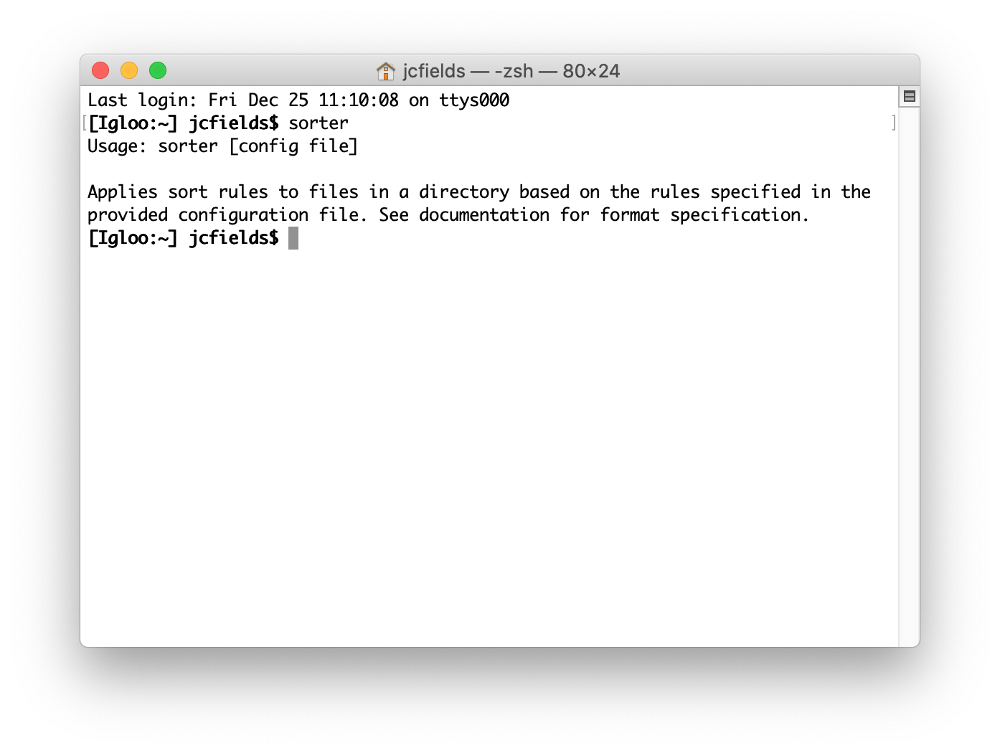
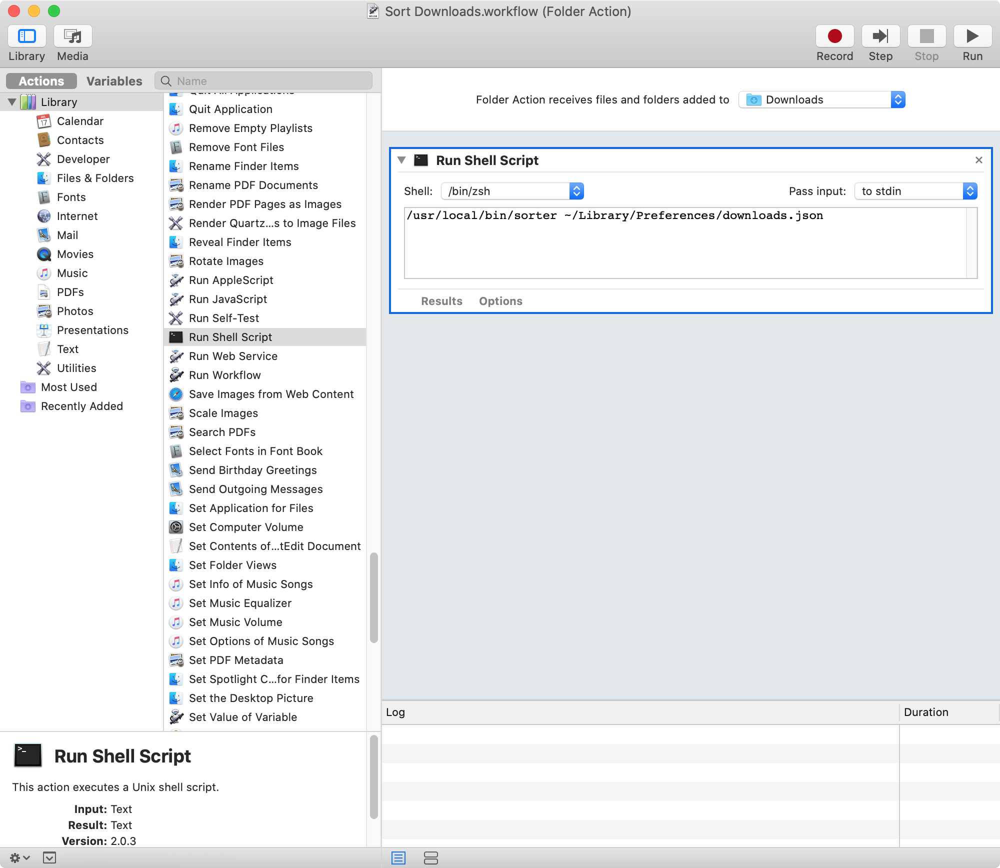

# sorter

A command-line utility that sorts files by metadata on Mac OS. Written in Objective-C. Requires Mac OS 10.12 (Sierra) or higher.

Meant to be used in conjunction with Folder Actions to automatically move downloaded files based on certain criteria. Run the program from the command line to see error messages for testing.



## Releases

Binary versions are available on the [Releases](https://github.com/jcfieldsdev/sorter/releases) page.

Binaries are self-signed but not notarized, so Mac OS 10.15 (Catalina) and higher display an error upon launching it. [Right-click the application icon and select "Open"](https://support.apple.com/guide/mac-help/open-an-app-by-overriding-security-settings-mh40617/mac) to enable the option to bypass this security warning.

## Guide

Usage: `sorter [config file]`

Applies sort rules to files in a directory based on the rules specified in the provided configuration file.

## Configuration file format

The configuration file is a JSON-formatted file. Each configuration file contains rules for one directory.

You can use a utility such as [JSONLint](https://jsonlint.com/) to validate configuration files and identify syntax errors.

A sample file:

```javascript
{
    "directory": "~/Downloads",
    "options": {
        "directories":    false,
        "subdirectories": false,
        "hidden":         false
    },
    "rules": [
        {
            "description": "Discover statements",
            "conditions": [
                "fileName matches ^Discover-Statement-(\\d{4})(\\d{2})(\\d{2})-\\d{4}$",
                "extension is pdf",
                "sourceURL contains card.discover.com",
                "sourceURL contains statements"
            ],
            "actions": [
                "moveTo ~/Documents/Financial/Discover/Statements",
                "renameToMatches $1:$2"
            ]
        }, {
            "description": "E-Trade statements",
            "conditions": [
                "fileName matches ^Brokerage Statement - XXXX\\d{4} - (\\d{4})(\\d{2})$",
                "extension is pdf",
                "sourceURL contains edoc.etrade.com",
                "sourceURL contains docType=stmt"
            ],
            "actions": [
                "moveTo ~/Documents/Financial/E-Trade/Statements",
                "renameToMatches $1:$2"
            ]
        }, {
            "description": "E-Trade trade confirmations",
            "conditions": [
                "fileName matches ^ETRADE Brokerage Trade Confirmation - XXXX\\d{4} - (\\d{4})(\\d{2})(\\d{2})$",
                "extension is pdf",
                "sourceURL contains edoc.etrade.com",
                "sourceURL contains docType=cnf"
            ],
            "actions": [
                "moveTo ~/Documents/Financial/E-Trade/Trade Confirmations",
                "renameToMatches $1:$2:$3"
            ]
        }
    ]
}
```

### Directory

The target directory. The program scans all of the files in this directory when run and applies all rules to each file.

### Options

This section is optional. Options are false by default if omitted.

| Option | Type | Description |
| - | - | - |
| `directories` | Boolean | Include directories |
| `subdirectories` | Boolean | Include files in subdirectories (recursively) |
| `hidden` | Boolean | Include hidden files |
| `allowExec` | Boolean | Enables `runCommand` action |

### Rules

Supports an arbitrary number of rules. Rules have conditions and actions. The program checks every condition for each file, and if satisfied, the actions are performed on the file.

#### Conditions

Conditions are strings containing three components by spaces: an attribute to test, a comparison operator, and a subject.

Actions are only executed if the prerequisite conditions are true. If there are multiple conditions, *all* conditions must be true.

##### File attributes

Attributes are specified by the `attribute` key in a condition.

Use the `mdls` utility from the command-line to view a file's metadata.

###### General

| Attribute | Type | Description |
| - | - | - |
| `path` | String | Full path to file (including containing directory) |
| `fileName` | String | Name of file (without extension) |
| `fullFileName` | String | Name of file (with extension) |
| `extension` | String | File extension (without dot) |
| `directoryName` | String | Path to containing directory |
| `kind` | String | Kind of file (as shown in the Finder) |
| `contentType` | String | UTI identifier for file type |
| `fileSize` | Integer | Size of file |
| `dateCreated` | Date | Date/time file was created |
| `dateModified` | Date | Date/time file was last modified |
| `dateOpened` | Date | Date/time file was last opened |
| `sinceCreated` | Float | Time in seconds since file was created |
| `sinceModified` | Float | Time in seconds since file was last modified |
| `sinceOpened` | Float | Time in seconds since file was last opened |
| `comment` | String | Finder comment for file |
| `tag` | Array | Finder tags for file |
| `sourceURL` | Array | URLs from which the file was downloaded (contains multiple URLs for the source page and the downloaded file) |
| `author` | Array | Author of the file |

Array attributes contain multiple string values.

###### Directories

| Attribute | Type | Description |
| - | - | - |
| `children` | Integer | Number of files in directory (includes ".DS_Store" and other hidden files) |

###### Documents

| Attribute | Type | Description |
| - | - | - |
| `pages` | Integer | Number of pages in document |
| `pageWidth` | Integer | Width of first page of document in pixels |
| `pageHeight` | Integer | Height of first page of document in pixels |

###### Images

| Attribute | Type | Description |
| - | - | - |
| `imageWidth` | Integer | Width of image in pixels |
| `imageHeight` | Integer | Height of image in pixels |

###### Audio

| Attribute | Type | Description |
| - | - | - |
| `title` | String | Title of work |
| `composer` | String | Composer of work |
| `album` | String | Album containing work |
| `genre` | String | Genre of work |
| `year` | String | Year of work |
| `track` | Integer | Track number |
| `duration` | Float | Length of file in seconds |

The recording artist is stored under the `author` attribute.

##### Comparison operators

Comparison operators describe how the file attribute is compared with the user-provided subject.

###### Integers and Dates

Dates must be given as [Unix epochs](https://www.epochconverter.com/) and are compared as integers.

- `is`, `equalTo`, `=`, or `==`
- `isNot`, `notEqualTo`, `!=`, or `<>`
- `lessThan` or `<`
- `greaterThan` or `>`
- `lessThanOrEqualTo` or `<=`
- `greaterThanOrEqualTo` or `>=`

###### Strings

String comparisons are always case insensitive.

Elements of arrays (such as tags) are compared as strings. The array evaluates as true if *any* element is true.

- `is`, `equalTo`, `=`, or `==`
- `isNot`, `notEqualTo`, `!=`, or `<>`
- `isEmpty`
- `isNotEmpty`
- `contains` or `includes`
- `doesNotContain` or `doesNotInclude`
- `matches` or `=~`
- `doesNotMatch` or `!~`
- `beginsWith` or `startsWith`
- `endsWith`
- `doesNotBeginWith` or `doesNotStartWith`
- `doesNotEndWith`

The `matches` and `doesNotMatch` conditions are used for regular expression matching. Backslashes and quotation marks must be escaped with backslashes for JSON (for example, `\\d` instead of `\d`). Malformed regular expressions do not cause errors; use an online utility or a text editor to test regular expressions.

##### Subjects

The subject is a user-provided value that is compared against the chosen file attribute to determine the truth of the condition. It must be the same type as the file attribute: a number, a string, or a date string. Spaces in subjects do not need to be escaped.

#### Actions

Actions are strings containing two components separated by spaces: a method and a subject.

##### Methods

Multiple actions are executed in the order in which they appear in the file. Actions stop executing if an error is encountered.

| Action | Subject |
| - | - |
| `renameTo` | File name (without extension), use `changeExtensionTo` to change extension |
| `renameToCurrentDate` | Date format string |
| `renameToDateCreated` | Date format string |
| `renameToDateModified` | Date format string |
| `renameToDateOpened` | Date format string |
| `renameToMatches` | Match string |
| `prepend` | String |
| `prependCurrentDate` | Date format string |
| `prependDateCreated` | Date format string |
| `prependDateModified` | Date format string |
| `prependDateOpened` | Date format string |
| `prependMatches` | Match string |
| `append` | String |
| `appendCurrentDate` | Date format string
| `appendDateCreated` | Date format string |
| `appendDateModified` | Date format string |
| `appendDateOpened` | Date format string |
| `appendMatches` | Match string |
| `moveTo` | Path (without file name), use `renameTo` to rename file |
| `moveToTrash` | Does not require subject |
| `copyTo` | Path (without file name), use `renameTo` to rename copy |
| `changeExtensionTo` | File extension (without dot) |
| `makeAliasAt` | Full path (including alias name) |
| `addTag` | Tag name, creates new tag if it does not exist |
| `removeTag` | Tag name, no error if tag does not exist |
| `runCommand` | Array with command and arguments (see subsection) |

##### Subjects

Spaces in subjects do not need to be escaped.

A number is appended (or incremented) at the end of the file name if a file by that name already exists.

The colon character `:` is shown as a slash `/` in the Finder.

Date format strings use [NSDateFormatter](https://nsdateformatter.com/) syntax.

Match strings can include any matches that were captured by the `matches` condition using a [capture group](https://www.regular-expressions.info/brackets.html). Matches are referenced by `$n`. For example, `$1` is the first match, `$2` for the second match, and so forth.

##### Run command

To enable the `runCommand` action, you must add `allowExec` to the `options` section of the configuration file with a value of `true`.

The subject for this action is must contain the full path to the command as the first element and any flags or options as additional elements (if necessary). The path to the file is automatically added as a final argument.

An example rule that matches gzipped invoices downloaded from eBay, moves and renames them, and unzips them:

```javascript
        {
            "description": "eBay invoices",
            "conditions": [
                "fileName startsWith Invoice_",
                "fileName endsWith .html",
                "extension is gz",
                "sourceURL contains ebay.com",
                "sourceURL matches .+&invoiceMonthYear=(\\d{1,2}):(\\d{4}):.+"
            ],
            "actions": [
                "moveTo ~/Documents/Financial/eBay/Invoices",
                "renameToMatches $2:$1.html",
                "runCommand /usr/bin/gzip -d"
            ]
        }
```

### Creating Folder Action in Automator

Download the program and place its executable file wherever you want it. The standard location for it is in `/usr/local/bin` (press `Cmd`+`Shift`+`.` in the Finder to toggle hidden files and directories).



Open **Automator** and create a new workflow by selecting *New* from the *File* menu (or pressing `Cmd`+`N`). Select *Folder Action*. From the second pane, scroll to "Run Shell Script" and drag and drop it onto the workflow in the rightmost pane.

In the rightmost pane, select "Choose folder" and choose the directory whose files you want to sort (which should correspond to the `directory` key of the configuration file).

In the multiline text field below this, enter the location of the executable followed by the path to the configuration file, as shown in the screen shot. Spaces and other special characters in paths must be escaped with backslashes.

Then save the workflow by selecting *Save* from the *File* menu (or pressing `Cmd`+`S`).

Error messages are printed to stderr and can be redirected to a log file using the `2>` operator.

## Acknowledgments

Uses parts of [alerter](https://github.com/vjeantet/alerter) by [Valère Jeantet](https://vjeantet.fr/) for notifications.

Uses [folder icon](https://www.svgrepo.com/svg/148137/folder) by [SVG Repo](https://www.svgrepo.com/).

## Authors

- J.C. Fields <jcfields@jcfields.dev>

## License

- [MIT license](https://opensource.org/licenses/mit-license.php)
